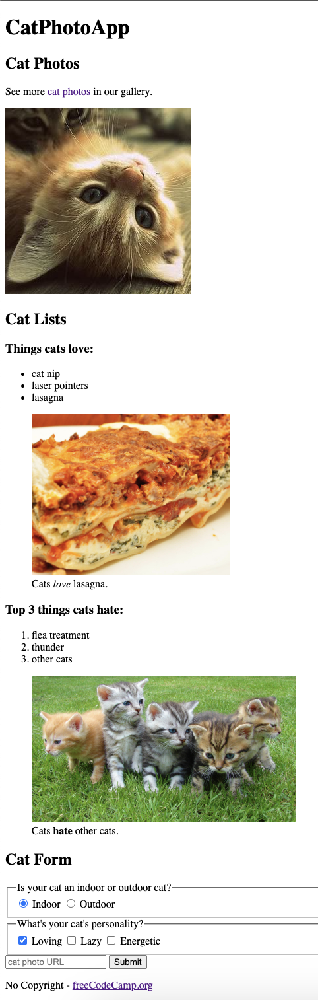

# Cat-Registration-Form

This was following the first tutorial in the freeCodeCamp Responsive Web Design Certification course. 

This website utilizes pictures, lists, input buttons (radio and checkboxes) and boxes, and redirecting links.

This project uses no CSS.

